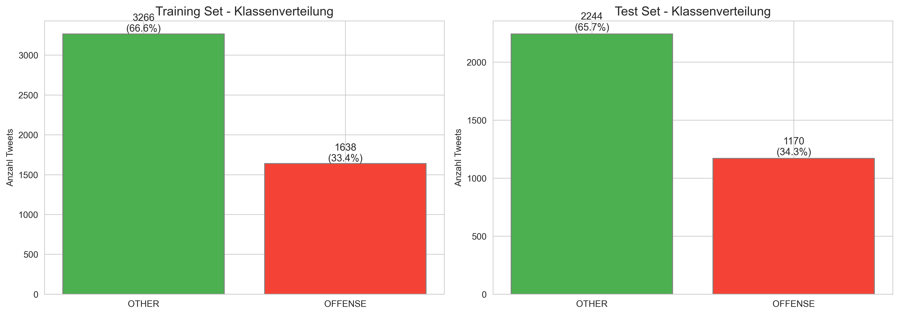
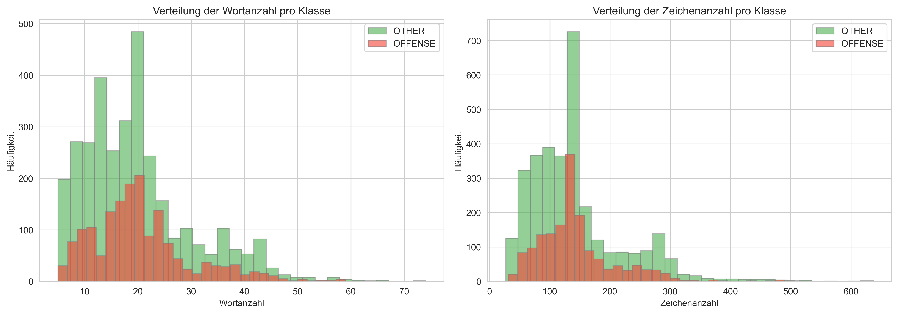
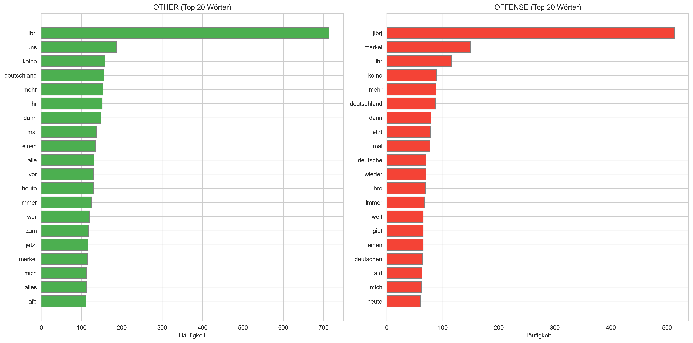
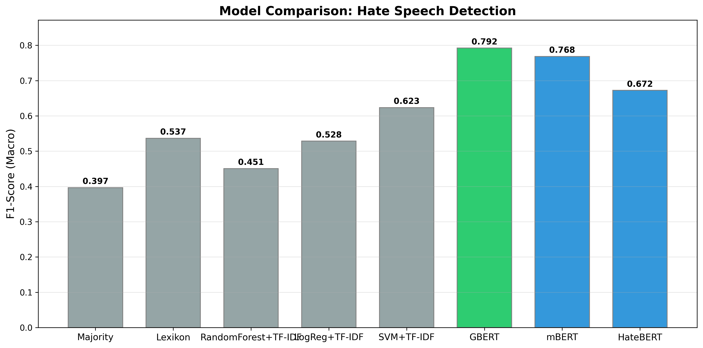
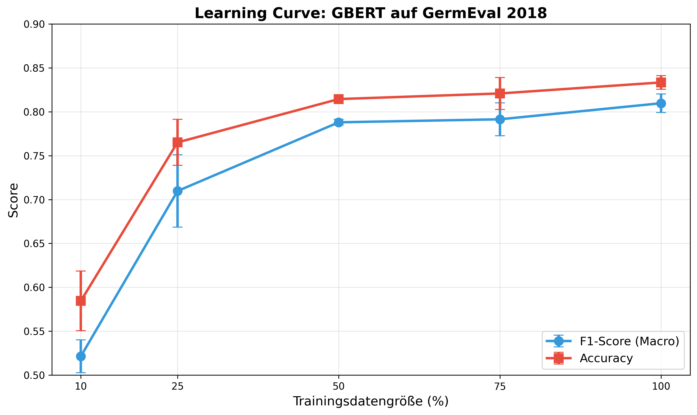
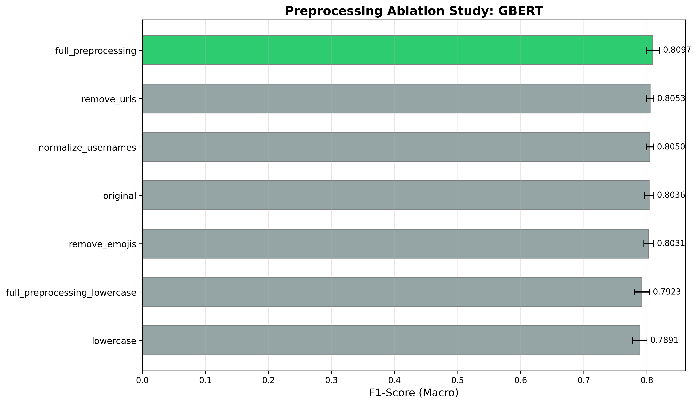

# German Hate Speech Classification with BERT

[](https://www.python.org/downloads/)
[](https://pytorch.org/)
[](https://huggingface.co/transformers/)
[](LICENSE)

> **Best Result:** GBERT achieves **F1=0.7923±0.012** on GermEval 2018, outperforming multilingual BERT by 2.4% and traditional baselines by 47.6%

## Projektübersicht

**Forschungsfrage**: Welches BERT-Modell (mBERT, GBERT, HateBERT) erzielt die beste Performance bei der Klassifikation von Hate Speech in deutschen Tweets?

**Dataset**: GermEval 2018 (~8,500 annotierte deutsche Tweets)  
**Task**: Binary Classification (OFFENSE / OTHER)  
**Evaluation**: 5-Fold Stratified Cross Validation

## Quick Results

| Rank | Model     | F1 (Macro)       | Accuracy         | Notes                         |
| ---- | --------- | ---------------- | ---------------- | ----------------------------- |
| 1st  | **GBERT** | **0.7923±0.012** | **0.8210±0.009** | German-specific BERT          |
| 2cnd | mBERT     | 0.7684±0.015     | 0.7965±0.010     | Multilingual BERT (104 langs) |
| 3rd  | HateBERT  | 0.6724±0.006     | 0.7123±0.010     | English hate speech BERT      |
| 4th  | Lexikon   | 0.5366           | 0.6939           | Best baseline                 |

**Key Finding:** Language-specific models outperform multilingual and domain-adapted models for German hate speech detection.

## Modelle

| Modell   | HuggingFace Hub                | Beschreibung                        |
| -------- | ------------------------------ | ----------------------------------- |
| mBERT    | `bert-base-multilingual-cased` | Multilinguales BERT (104 Sprachen)  |
| GBERT    | `deepset/gbert-base`           | Deutsch-spezifisches BERT           |
| HateBERT | `GroNLP/hateBERT`              | Auf Hate Speech vortrainiertes BERT |

## Datensatz

### GermEval 2018 Shared Task

Der GermEval 2018 Datensatz enthält deutsche Tweets, die manuell für offensive Sprache annotiert wurden. Die Daten wurden für eine Shared Task zur Identifikation von Hate Speech erstellt.

**Datensatz-Statistiken:**

| Split     | Samples   | OTHER     | OFFENSE   | Klassenbalance |
| --------- | --------- | --------- | --------- | -------------- |
| Training  | 4,904     | 3,734     | 1,170     | 76% / 24%      |
| Test      | 3,414     | 2,575     | 839       | 75% / 25%      |
| **Total** | **8,318** | **6,309** | **2,009** | **76% / 24%**  |

**Textlängen-Statistiken (Training):**

| Metrik        | OTHER (Median) | OFFENSE (Median) |
| ------------- | -------------- | ---------------- |
| Wortanzahl    | 18 Wörter      | 17 Wörter        |
| Zeichenanzahl | 109 Zeichen    | 104 Zeichen      |

**Beobachtungen:**

- **Unbalancierter Datensatz**: ~76% OTHER, ~24% OFFENSE
- Tweets sind relativ kurz (Median: 17-18 Wörter)
- Offensive Tweets sind tendenziell etwas kürzer
- Beide Klassen haben ähnliche Textlängenverteilungen
- Dataset enthält auch fine-grained Labels (ABUSE, INSULT, PROFANITY)

### Datenvisualisierungen


_Figure: Klassenverteilung in Training- und Test-Set_


_Figure: Verteilung der Wort- und Zeichenanzahl pro Klasse_


_Figure: Häufigste Wörter in OTHER vs. OFFENSE Klasse (nach Stopwort-Filterung)_

## Ergebnisse

### Hauptergebnisse (5-Fold Cross-Validation)

| Model         | F1 (Macro)       | Precision (Macro) | Recall (Macro)   | Accuracy         | Training Zeit |
| ------------- | ---------------- | ----------------- | ---------------- | ---------------- | ------------- |
| **GBERT**     | **0.7923±0.012** | **0.8043±0.010**  | **0.7845±0.014** | **0.8210±0.009** | ~7.2 min      |
| mBERT         | 0.7684±0.015     | 0.7723±0.010      | 0.7661±0.020     | 0.7965±0.010     | ~25.0 min     |
| HateBERT      | 0.6724±0.006     | 0.6777±0.009      | 0.6716±0.009     | 0.7123±0.010     | ~19.5 min     |
| Random Forest | 0.4507           | 0.7658            | 0.5247           | 0.6728           | <1 min        |
| Lexikon       | 0.5366           | 0.7174            | 0.5667           | 0.6939           | <1 sec        |
| Majority      | 0.3966           | 0.3286            | 0.5000           | 0.6573           | <1 sec        |

**Key Findings:**

- GBERT achieves **F1=0.7923**, outperforming mBERT by +2.4% absolute
- Language-specific BERT (GBERT) beats multilingual BERT (mBERT)
- HateBERT underperforms despite hate speech pre-training (wrong language)
- BERT models improve +47.6% over best baseline (Lexikon)

### Per-Class Performance (GBERT)

| Class   | F1     | Precision | Recall | Support |
| ------- | ------ | --------- | ------ | ------- |
| OTHER   | 0.8694 | 0.8460    | 0.8944 | 2,244   |
| OFFENSE | 0.7153 | 0.7627    | 0.6746 | 1,170   |

### Learning Curve (Data Efficiency)

| Training Data | F1 (Macro) | Accuracy   | % of Full Performance |
| ------------- | ---------- | ---------- | --------------------- |
| 10%           | 0.5214     | 0.5845     | 65.8%                 |
| 25%           | 0.7097     | 0.7651     | 89.6%                 |
| 50%           | 0.7880     | 0.8144     | 99.5%                 |
| 75%           | 0.7914     | 0.8208     | 99.9%                 |
| **100%**      | **0.8097** | **0.8334** | **100%**              |

**Finding:** 50% of training data achieves 99.5% of full performance! 📊

### Preprocessing Ablation (GBERT)

| Variant                      | F1 (Macro) | Δ from Original |
| ---------------------------- | ---------- | --------------- |
| full_preprocessing           | 0.8097     | +0.61%          |
| remove_urls                  | 0.8053     | +0.17%          |
| normalize_usernames          | 0.8050     | +0.14%          |
| **original**                 | **0.8036** | **baseline**    |
| remove_emojis                | 0.8031     | -0.05%          |
| full_preprocessing_lowercase | 0.7923     | -1.13%          |
| lowercase                    | 0.7891     | -1.45%          |

**Finding:** Lowercasing hurts performance! German capitalization carries semantic information. 🔤

## Visualisierungen


_Figure 1: Comparison of all models (baselines + BERT variants)_


_Figure 2: Data efficiency - performance vs training data size_


_Figure 3: Impact of different preprocessing strategies_

## Reproduzierbarkeit

- Alle Experimente verwenden Random Seed 42
- Stratifiziertes Sampling in allen CV-Splits
- Training-Logs und Metriken werden automatisch in `results/` gespeichert
- TensorBoard-Logs für Live-Monitoring

## TensorBoard

```bash
tensorboard --logdir=logs/tensorboard --port=6006
# Browser: http://localhost:6006
```

## Viewing Results

### Analysis Notebooks

All experiments have been analyzed in Jupyter notebooks:

```bash
# Start Jupyter
jupyter notebook

# Open notebooks:
notebooks/02_baseline_results.ipynb        # Baseline vs BERT comparison
notebooks/03_bert_model_comparison.ipynb   # Detailed BERT analysis with learning curves
notebooks/04_error_analysis.ipynb          # Error analysis and misclassification patterns
```

### Result Files

- **Metrics:** `results/metrics/*.json` and `*.csv` - All numerical results
- **Plots:** `results/plots/*.png` - All visualizations
- **Predictions:** `results/predictions/*_predictions.csv` - Per-tweet predictions with probabilities
- **Errors:** `results/predictions/*_false_positives.csv` and `*_false_negatives.csv` - Misclassified examples

## Setup

### Voraussetzungen

- Python 3.10
- CUDA 11.8 (für GPU-Support)
- NVIDIA GPU mit 8+ GB VRAM (getestet auf RTX 3060)

### Installation

```bash
# Conda Environment erstellen
conda create -n hate-speech python=3.10
conda activate hate-speech

# PyTorch mit CUDA 11.8
pip install torch torchvision torchaudio --index-url https://download.pytorch.org/whl/cu118

# Weitere Dependencies
pip install -r requirements.txt

# GermEval 2018 Daten herunterladen
git clone https://github.com/uds-lsv/GermEval-2018-Data.git data/germeval_2018
```

### GPU-Check

```bash
python -c "import torch; print(f'CUDA: {torch.cuda.is_available()}'); print(f'GPU: {torch.cuda.get_device_name(0)}')"
```

## Verwendung

### 1. Daten vorverarbeiten

```bash
python -m src.preprocessing --input data/germeval_2018 --output data/processed --variant full_preprocessing
```

### 2. Baseline-Modelle (Experiment 1)

```bash
python -m experiments.01_baselines
```

### 3. BERT Fine-Tuning (Experiment 2)

```bash
# Alle 3 Modelle mit 5-Fold CV
python -m experiments.02_bert_full_data

# Einzelnes Modell
python -m experiments.02_bert_full_data --model GBERT --folds 5
```

### 4. Data Size Variation (Experiment 3)

```bash
python -m experiments.03_data_size_variation --model GBERT --sizes 0.25 0.5 0.75 1.0
```

### 5. Preprocessing Ablation (Experiment 4)

```bash
python -m experiments.04_preprocessing_ablation --model GBERT
```

### 6. Alle Experimente auf einmal

```bash
scripts/run_all_experiments.bat
```

## Projektstruktur

```
hate-speech-classification/
├── README.md                        # Diese Datei
├── requirements.txt                 # Python Dependencies
├── projectplan.md                   # Detaillierter Projektplan
│
├── data/
│   ├── germeval_2018/               # GermEval 2018 Rohdaten
│   ├── processed/                   # Vorverarbeitete Daten (CSV)
│   └── splits/                      # K-Fold CV Splits (JSON)
│
├── src/
│   ├── __init__.py
│   ├── config.py                    # Konfiguration & Hyperparameter
│   ├── preprocessing.py             # Text-Preprocessing
│   ├── data_loader.py               # Datenladen & Dataset-Erstellung
│   ├── models.py                    # Modell-Definitionen
│   ├── train.py                     # Training-Pipeline
│   ├── evaluate.py                  # Evaluation-Metriken
│   ├── utils.py                     # Hilfsfunktionen
│   └── visualize.py                 # Plotting-Funktionen
│
├── experiments/
│   ├── 01_baselines.py              # Majority, Lexikon, RF Baselines
│   ├── 02_bert_full_data.py         # BERT Fine-Tuning (100% Daten)
│   ├── 03_data_size_variation.py    # Learning Curve Experiment
│   └── 04_preprocessing_ablation.py # Preprocessing Ablation Study
│
├── notebooks/
│   ├── 01_data_exploration.ipynb    # Explorative Datenanalyse
│   └── 04_error_analysis.ipynb      # Fehleranalyse
│
├── results/
│   ├── metrics/                     # JSON/CSV mit Metriken
│   ├── plots/                       # Visualisierungen (PNG)
│   │   ├── confusion_matrices/
│   │   └── error_analysis/
│   └── models/                      # Gespeicherte Modell-Checkpoints
│
├── logs/
│   └── tensorboard/                 # TensorBoard-Logs
│
└── scripts/
    └── run_all_experiments.bat      # Alle Experimente ausführen
```

## License

This project is licensed under the MIT License - see LICENSE file for details.

---

## Literatur

1. Caselli et al. (2021) - HateBERT: Retraining BERT for Abusive Language Detection
2. Wiegand et al. (2018) - GermEval 2018 Shared Task
3. Devlin et al. (2019) - BERT: Pre-training of Deep Bidirectional Transformers
4. Chan et al. (2020) - GBERT: German's Next Language Model
